## Hướng dẫn sử dụng Pritunl để cung cấp dịch vụ VPN trong OpenStack

### Mục tiêu LAB
- Mô hình này sử dụng 2 máy ảo trong OpenStack (cùng tenant), trong đó:
  - VM Pritunl đóng vai trò VPN Server.
  - VM Client
Bài lab thành công khi máy remote quay VPN thành công và ping được tới dải VM Client (dải Private) trong tenant.

## Mô hình 
- Sử dụng mô hình dưới để cài đặt
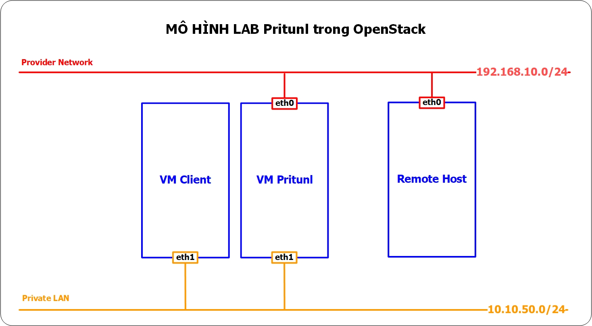

## IP Planning
- Phân hoạch IP cho các máy chủ trong mô hình trên
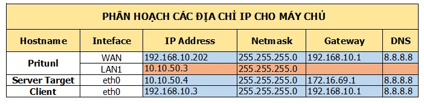

## Chuẩn bị và môi trường LAB
- Máy remote: OS Ubunu 14.04
- Máy Client: OS Ubuntu 14.04
- Máy PFSense: tham khảo hướng dẫn cài đặt ở [đây](./pfSense-install.md)
 

## Thực hiện trên host Pritunl
  - Update và upgrade hệ điều hành
  ```sh
  apt-get update && sudo apt-get upgrade -y
  ```

  - Add MongoDB apt source
  ```sh
  touch /etc/apt/sources.list.d/mongodb-org-3.0.list
  echo "deb http://repo.mongodb.org/apt/ubuntu trusty/mongodb-org/3.0 multiverse" > /etc/apt/sources.list.d/mongodb-org-3.0.list
  ```

  - Add Pritunl source
  ```sh
  touch /etc/apt/sources.list.d/pritunl.list
  echo "deb http://repo.pritunl.com/stable/apt trusty main" > /etc/apt/sources.list.d/pritunl.list
  ```

  - Add Public cho Repo
  ```sh
  apt-key adv --keyserver hkp://keyserver.ubuntu.com --recv 7F0CEB10
  apt-key adv --keyserver hkp://keyserver.ubuntu.com --recv CF8E292A
  ```

  - Update lại source
  ```sh
  apt-get update
  ```

  - Cài đặt package của Pritunl
  ```sh
  apt-get install pritunl mongodb-org -y
  ```

  - Khởi chạy pritunl
  ```sh
  service pritunl start
  ```

  - Lấy key setup
  ```sh
  pritunl setup-key
  ```
  Kết quả:
  ```sh
  790402f16d80c4af0ba46f643077c8ca
  ```

  - Đăng nhập vào Giao diện web của Pritunl tại địa chỉ: `https://192.168.10.202:443` và nhập setup key, chọn "Save"
  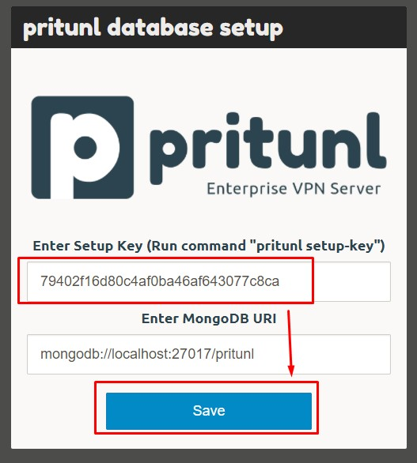

  - Đăng nhập sử dụng mật khẩu mặc định "pritunl/pritunl"
  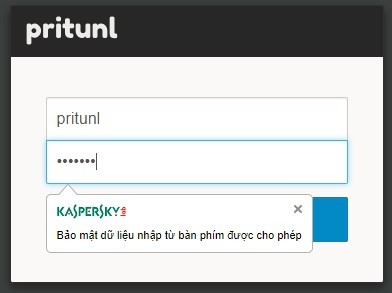

  - Khai báo các thông tin:
    + Tài khoản đăng nhập
    + Public address
    + Web console port
  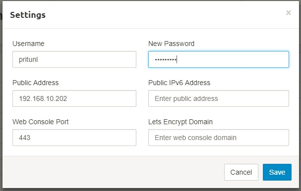  

  - Vào mục "Users", chọn "Add organization", đặt tên cho Organization
  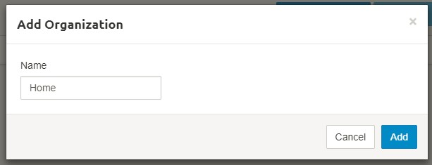 

  - Sau khi tạo Organization, lựa chọn "Add user"
  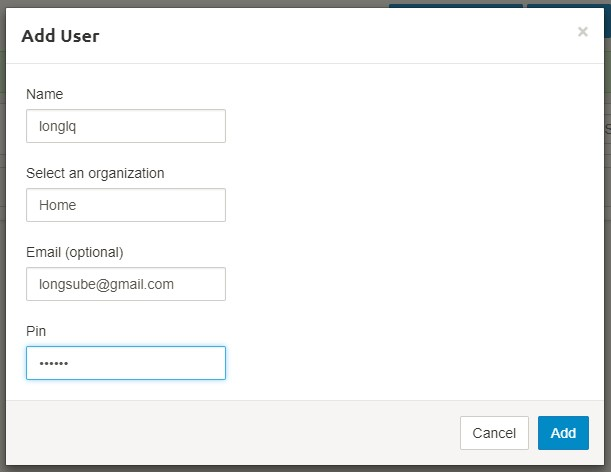 

  - Chuyển sang mục "Servers", chọn "Add Server", khai báo các thông tin cho Server:
    + Tên Server
    + Port và giao thức truy cập
    + Virtual network: đây là dải mạng để NAT các dải Private network tới Remote host.
  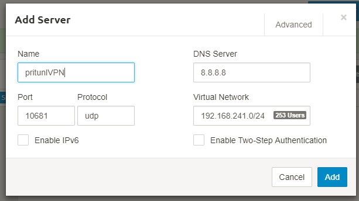

  - Sau khi add xong Server, tiếp tục chọn mục "Attach Organization"
  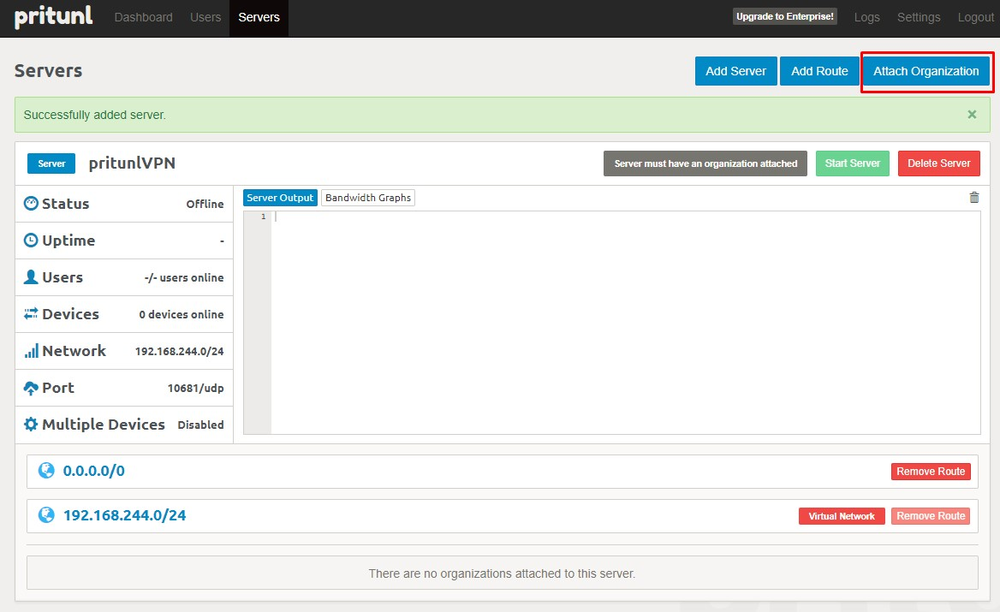

  - Lựa chọn Organization và Server vừa khai báo, chọn "Attach"
  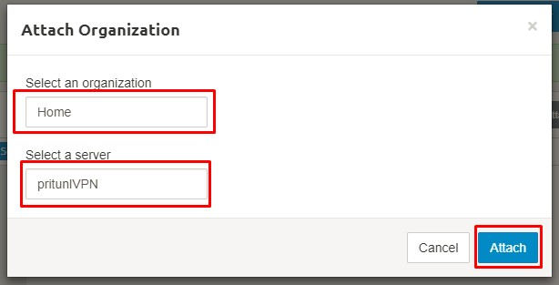

  - Thông báo Attach thành công, khởi chạy Server VPN
  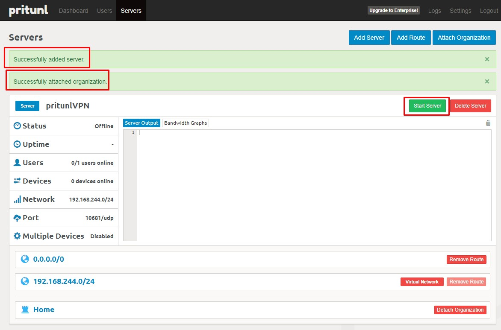

  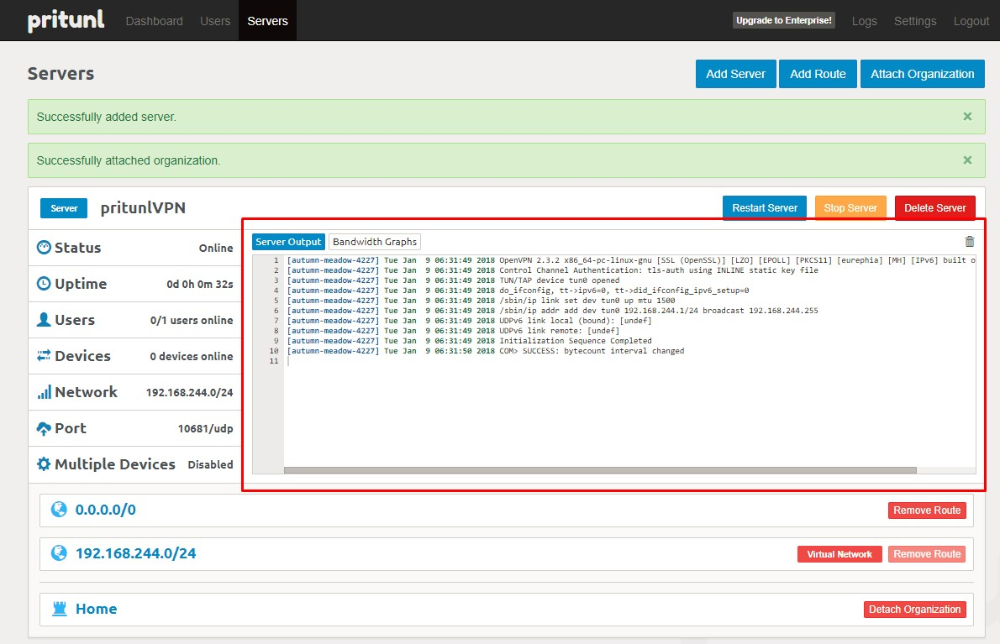

  - Vào mục User, lấy link download file config của VPN của user
  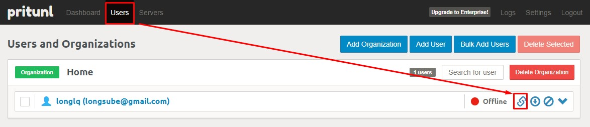

  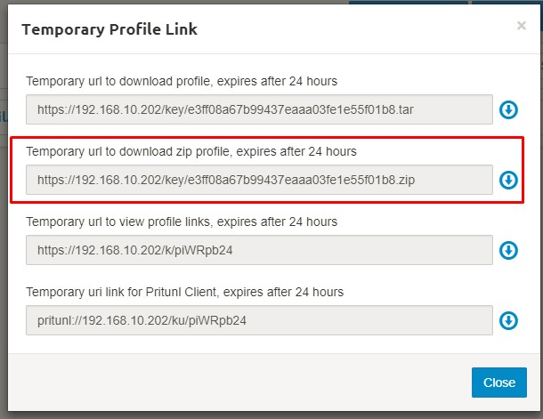

## Thực hiện trên host Controller của OpenStack
  - Lấy thông tin id port của VM Pritunl thưộc VLAN Private (IP: 10.10.50.3)
  ```sh
  neutron port-list | grep 10.10.50.3
  ```
  Kết quả:
  ```sh
  | 9cb68615-88a9-4617-b265-2b87603aae3d 9cb68615-88a9-4617-b265-2b87603aae3d |      | fa:16:3e:f3:3a:e8 | {"subnet_id": "24e110f9-2868-4827-a754-6a5b84367e42", "ip_address": "10.10.50.3"}     |
  ```

  - Cho phép nhiều VLAN được đi qua port này
  ```sh
  neutron port-update 9cb68615-88a9-4617-b265-2b87603aae3d --allowed-address-pairs list=true type=dict ip_address=0.0.0.0/0
  ```
  Kết quả: 
  ```sh
  Updated port: 9cb68615-88a9-4617-b265-2b87603aae3d
  ```

  - Kiểm tra thông tin port
  ```sh
  neutron port-show 9cb68615-88a9-4617-b265-2b87603aae3d
  ```
  Kết quả:
  ```sh
+-----------------------+-----------------------------------------------------------------------------------+
| Field                 | Value                                                                             |
+-----------------------+-----------------------------------------------------------------------------------+
| admin_state_up        | True                                                                              |
| allowed_address_pairs | {"ip_address": "0.0.0.0/0", "mac_address": "fa:16:3e:f3:3a:e8"}                   |
| binding:host_id       | compute1                                                                          |
| binding:profile       | {}                                                                                |
| binding:vif_details   | {"port_filter": true}                                                             |
| binding:vif_type      | bridge                                                                            |
| binding:vnic_type     | normal                                                                            |
| created_at            | 2018-01-09T09:01:04                                                               |
| description           |                                                                                   |
| device_id             | 3d34599a-133d-4bc8-bdd9-eac8a4a7121d                                              |
| device_owner          | compute:nova                                                                      |
| extra_dhcp_opts       |                                                                                   |
| fixed_ips             | {"subnet_id": "24e110f9-2868-4827-a754-6a5b84367e42", "ip_address": "10.10.50.3"} |
| id                    | 9cb68615-88a9-4617-b265-2b87603aae3d                                              |
| mac_address           | fa:16:3e:f3:3a:e8                                                                 |
| name                  |                                                                                   |
| network_id            | 408a3790-9ffa-46c0-ae43-6ef949d4dfb6                                              |
| port_security_enabled | True                                                                              |
| security_groups       | 2043b551-75e4-4d34-a6f8-24a12cc3d221                                              |
| status                | ACTIVE                                                                            |
| tenant_id             | c90c0d45e11643d1a5706329f2089db9                                                  |
| updated_at            | 2018-01-10T04:42:55                                                               |
+-----------------------+-----------------------------------------------------------------------------------+
```

 - Để gỡ allow address pair, dùng lệnh:
  ```sh
  neutron port-update 9cb68615-88a9-4617-b265-2b87603aae3d --no-allowed-address-pairs
  ```

 - Dùng lệnh sau để mở port VPN trên Security group default (udp 10681)
  ```sh
  openstack security group rule create --dst-port 10681 --proto udp  default
  ``` 

## Thực hiện trên máy ảo Client
  - Add route cho dải mạng 192.168.241.0/24
  ```sh
  ip route add 192.168.241.0/24 via 10.10.50.3 dev eth1
  ```

## Thực hiện trên host Remote, kết nối VPN
  - Trên host Remote, cài đặt OpenVPN
    ```sh
    apt-get update -y
    appt-get install openvpn
    ```

  - Giải nén gói cấu hình VPN download từ Pritunl vào thư mục /etc/openvpn
  	```sh
  	apt-get install unzip -y
  	unzip longlq.zip -d /etc/openvpn
  	```

  - Đổi tên file
  	```sh
  	cd /etc/openvpn
  	mv Home_longlq_pritunlVPN.ovpn Home_longlq_pritunlVPN.conf
  	```

  - Kết nối VPN
  	```sh
  	openvpn --config Home_longlq_pritunlVPN.conf
  	```
    Khai báo Username và password của user
    ```sh
    Enter Auth Username:longlq
    Enter Auth Password:
    ```

  - Kiểm tra bằng lệnh `ip a`, host đã nhận IP của Tunnel
  	```sh
  	tun0: <POINTOPOINT,MULTICAST,NOARP,UP,LOWER_UP> mtu 1500 qdisc pfifo_fast state UNKNOWN group default qlen 100
    link/none 
    inet 192.168.241.3/24 brd 192.168.241.255 scope global tun0
       valid_lft forever preferred_lft forever
  	```

  - Kiểm tra ping vào IP LAN của dải VM Client
  	```sh
  	ping 10.10.50.4
  	```


Tham khảo:

[1] - http://superuser.openstack.org/articles/managing-port-level-security-openstack/

[2] - https://www.vultr.com/docs/setup-a-vpn-server-with-pritunl-on-ubuntu
